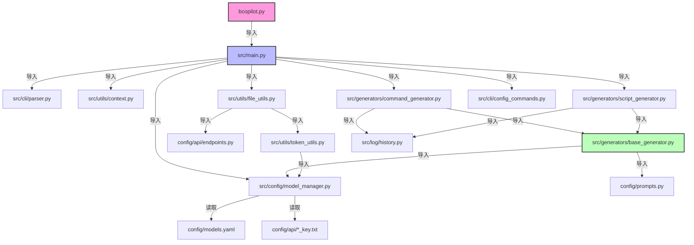
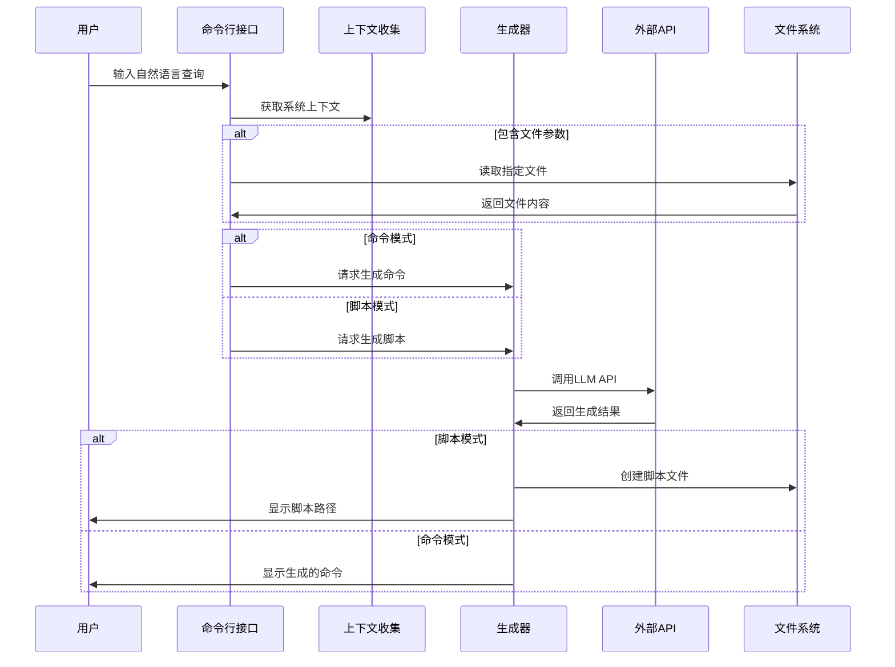

# Bash-Copilot


Bash-Copilot 是一个基于AI的纯命令行工具，将自然语言转换为bash命令或脚本。它支持生成单行命令和完整的shell脚本，能够根据指定文件内容提供上下文相关的命令生成，为命令行操作提供智能辅助。

## 🚀 特性

- **自然语言转bash命令**：轻松将自然语言查询转换为可执行的bash命令
- **脚本生成**：生成功能完整的shell脚本，包含错误处理、注释和最佳实践
- **文件上下文**：支持读取本地文件作为上下文，生成针对特定文件的命令
- **模型灵活性**：支持多种LLM服务商，可轻松切换或添加新模型
- **Token估算**：自动估算API调用的token消耗，防止超出限制
- **历史记录**：自动记录查询和生成结果，方便查阅和重用
- **彩色输出**：生成的命令和脚本以彩色方式显示，提高可读性

## 📋 项目结构

```
bashCopilot/
├── config/                  # 配置目录
│   ├── api/                 # API相关配置
│   │   ├── __init__.py      # 包初始化文件
│   │   ├── endpoints.py     # API端点配置
│   │   ├── siliconflow_key.txt  # 硅基流动API密钥
│   │   └── openrouter_key.txt   # OpenRouter API密钥
│   ├── __init__.py          # 包初始化文件
│   ├── constants.py         # 常量定义
│   ├── models.yaml          # 模型配置文件
│   └── prompts.py           # 提示词模板
├── docs/                    # 文档目录
│   ├── 添加模型指南.md       # 模型配置指南
│   ├── todo.md              # 待办事项
│   └── updatePlan-v0.0.1.md # 更新计划
├── logs/                    # 日志目录
├── src/                     # 源代码目录
│   ├── cli/                 # 命令行接口
│   │   ├── config_commands.py  # 配置相关命令
│   │   └── parser.py        # 命令行参数解析
│   ├── config/              # 配置管理
│   │   ├── __init__.py      # 包初始化文件
│   │   └── model_manager.py # 模型配置管理器
│   ├── generators/          # 生成器模块
│   │   ├── base_generator.py     # 基础生成器
│   │   ├── command_generator.py  # 命令生成器
│   │   └── script_generator.py   # 脚本生成器
│   ├── log/                 # 日志模块
│   │   └── history.py       # 历史记录功能
│   ├── utils/               # 工具函数
│   │   ├── api_key.py       # API密钥处理
│   │   ├── context.py       # 上下文处理
│   │   ├── file_utils.py    # 文件处理
│   │   └── token_utils.py   # Token估算
│   ├── bcopilot.py          # 命令行入口脚本
│   ├── main.py              # 主程序入口
│   └── bashCopilot.py       # 旧版主程序
├── tests/                   # 测试目录
├── bashCopilot-env/         # 虚拟环境目录(可选)
├── .gitignore               # Git忽略文件
├── LICENSE                  # 许可证文件
└── README.md                # 项目说明文档
```

## 🔄 项目依赖图



## 🔍 模块功能

| 模块 | 功能描述 |
|------|---------|
| `bcopilot.py` | 命令行主入口，处理路径设置并调用主程序 |
| `main.py` | 主程序逻辑，协调各模块工作 |
| `cli/parser.py` | 命令行参数解析，定义所有可用选项 |
| `cli/config_commands.py` | 处理配置相关命令（显示、设置、添加模型等） |
| `config/model_manager.py` | 模型配置管理，读取和保存配置 |
| `generators/base_generator.py` | 基础生成器，处理API调用生成bash命令或脚本 |
| `generators/command_generator.py` | 命令生成专用逻辑 |
| `generators/script_generator.py` | 脚本生成专用逻辑，包括文件创建和格式处理 |
| `utils/context.py` | 获取系统环境上下文 |
| `utils/file_utils.py` | 文件处理工具，读取文件内容并估算token消耗 |
| `utils/token_utils.py` | Token计算功能 |
| `log/history.py` | 查询和结果的历史记录功能 |
| `config/api/endpoints.py` | API端点和模型信息配置 |
| `config/prompts.py` | 用于API调用的提示词模板 |

## 💻 环境要求

- Python 3.6+
- Linux/Unix系统（推荐Ubuntu 20.04或更高版本）
- 必要的Python库：
  - requests：用于API调用
  - pyyaml：用于配置文件管理
- 需要API密钥:
  - 硅基流动API密钥（用于生成单行命令）
  - OpenRouter API密钥（用于生成脚本）

## 🔧 安装

### 重要说明：Python包结构

Bash-Copilot使用相对导入路径。为确保项目正常运行，请确保所有目录中都有`__init__.py`文件，使它们被Python识别为有效的包。特别是：

- `config/` 目录需要 `__init__.py`
- `config/api/` 目录需要 `__init__.py`
- `src/` 下所有子目录都需要 `__init__.py`

如果运行时遇到`ModuleNotFoundError`，请检查相应路径是否缺少`__init__.py`文件。

### 步骤1：克隆仓库

```bash
git clone https://github.com/TLCFY/bashCopilot.git
cd bashCopilot
```

### 步骤2：设置Python环境

```bash
# 创建并激活虚拟环境(推荐但可选)
python3 -m venv bashCopilot-env
source bashCopilot-env/bin/activate

# 安装依赖
pip install requests pyyaml
```

### 步骤3：配置API密钥

```bash
# 创建API密钥目录(如果不存在)
mkdir -p config/api

# 添加硅基流动API密钥
echo "your_siliconflow_api_key" > config/api/siliconflow_key.txt

# 添加OpenRouter API密钥
echo "your_openrouter_api_key" > config/api/openrouter_key.txt

# 设置适当的文件权限(可选但推荐)
chmod 600 config/api/*.txt
```

### 步骤4：运行测试

```bash
# 测试命令生成
./src/bcopilot.py "查找当前目录下最大的5个文件"

# 如果出现权限问题，添加执行权限
chmod +x src/bcopilot.py
```

## 📝 使用方法

### 生成单行命令

将自然语言查询转换为单行bash命令：

```bash
./src/bcopilot.py "查找所有大于100MB的mp4文件"
./src/bcopilot.py "列出所有正在运行的docker容器"
./src/bcopilot.py "查找并删除超过30天的日志文件"
```

### 生成完整脚本

使用`-script`选项生成包含错误处理和注释的完整bash脚本：

```bash
./src/bcopilot.py -script "备份MySQL数据库"
./src/bcopilot.py -script "监控系统CPU和内存使用情况"
./src/bcopilot.py -script "批量处理图片并上传到远程服务器"
```

### 使用文件内容作为上下文

包含特定文件作为上下文，使生成的命令更相关：

```bash
./src/bcopilot.py -filename docker-compose.yml "启动这个服务"
./src/bcopilot.py -filename logs.txt config.json "分析这些文件"
```

### 配置管理

```bash
# 显示当前模型配置
./src/bcopilot.py config show

# 切换命令生成模型
./src/bcopilot.py config set command.openai

# 切换脚本生成模型
./src/bcopilot.py config set script.azure

# 添加新的模型提供商
./src/bcopilot.py config add-provider
```

### 查看帮助信息

```bash
./src/bcopilot.py -help
```

## 📊 工作流程



## 📄 文件组织

### API接口层

- `generators/base_generator.py`: 负责处理与API的通信，发送请求和接收响应

### 业务逻辑层

- `main.py`: 整体流程控制
- `generators/command_generator.py`: 命令生成逻辑
- `generators/script_generator.py`: 脚本生成逻辑
- `config/model_manager.py`: 模型配置管理

### 表示层

- `cli/parser.py`: 命令行参数处理
- `cli/config_commands.py`: 配置命令处理

### 工具和辅助功能

- `utils/`: 各种辅助功能
- `log/`: 日志和历史记录

## 🔌 添加新模型

Bash-Copilot 支持多种大语言模型，您可以添加自己喜欢的模型。详细步骤见[添加模型指南](docs/添加模型指南.md)。

### 快速添加示例

```bash
# 交互式添加
./src/bcopilot.py config add-provider

# 手动配置
# 1. 编辑 config/models.yaml
# 2. 添加API密钥文件
# 3. 切换到新模型
./src/bcopilot.py config set command.new_provider
```

## 🔨 开发说明

### 代码风格

- 使用类型注解增强代码可读性
- 采用详细文档字符串(docstrings)记录函数功能
- 遵循PEP 8命名约定

### 添加新功能

1. 在适当的模块中添加功能
2. 更新相关测试
3. 确保文档与代码同步

### 修改提示词

修改`config/prompts.py`中的提示词模板可以调整生成结果的风格和质量。

## 🔜 未来计划

- 添加更多模型提供商支持
- 命令执行建议和安全检查
- 支持更多命令行shell类型
- 创建pip安装包
- 增加工具安装指南
- 图形用户界面

## 📜 许可证

[MIT](./LICENSE)

## 👤 作者

[TLCFY](https://github.com/TLCFY)

## 🙏 致谢

- 硅基流动API
- OpenRouter
- DeepSeek AI
- Anthropic
